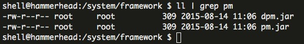
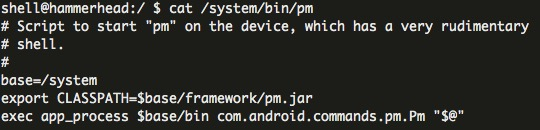

# 如何反编译 android 中 /data/dalvik-cache/arm 下的文件

## 背景故事

首先我要讲的第一件事情就是，最近在调奇酷手机大Q上的一个bug：使用 `installPackage` 这条 API 安装系统应用的时候总是失败，但是 `pm install` 又是成功的。没办法，我只有把系统的 `pm` 反编译来看一看了。

然后无奈手机太过于奇葩，一般 `pm.jar` 是放在 `/system/framework/` 下的，偏偏这台手机里边的 pm.jar 只有309字节大小，反编译出来没有任何代码。



但是 pm 命令是可以运行的，是否调用了其他地方呢？



好吧你厉害，你加载了一个空的 jar，没代码也能运行，没办法只有想想别的办法了。

## 了解一下 ART 和 Dalvik

[官方文档](https://source.android.com/devices/tech/dalvik/)、[这个章节的原文](http://www.mywiki.cn/hovercool/index.php/ART%E5%92%8CDalvik)

### Dalvik

首先我觉得了解这个是因为，既然 pm 是可以运行的，那代码一定是存在一个地方的。不过知道 ART 和 Dalvik 的话，就会知道，一定有 dex 缓存。

所有的 apk 内包含一个 classes.dex 文件。在 Dalvik上，apk包里的 dex文件在安装的时候会通过 dexopt 转化成另一个格式，叫odex（Opitimized dex），然后存在 /data/dalvik-cache里面，如： 

```
/data/dalvik-cache/data@app@com.wochacha-1.apk@classes.dex
```

虽然文件后缀还是 .dex，但是这个dex和apk内的那个已经不一样了。这个文件是针对当前机器的硬件对 dex 文件进行了定制化，也就是说把这个放到别的设备上，不一定能运行。

PS: 在要编译 rom 的时候，如果参数加上 "WITH_DEXPREOPT=true"，会在 /system/app/ 下同时生成 .apk 和 .odex 文件（注意，这里后缀又用的 .odex，但实际上和系统在 /data/dalvik-cache/ 下的 .dex文件是一样的）

### ART

在 ART上，apk 包里的 dex文件在安装的时候通过 dex2oat，也会生成一个后缀为 .dex 的文件，放在 /data/dalvik-cache中，如：

```
/data/dalvik-cache/arm/system@app@Bluetooth@Bluetooth.apk@classes.dex
/data/dalvik-cache/arm64/system@vendor@app@ims@ims.apk@classes.dex 
```

这个文件后缀叫 .dex ，但是这个文件又不一样了，这个既不是 dex 也不是 odex，用 dex2jar 的无法进行反编译的。文件格式也完全不同，因为这其实就是一个实打实的 elf文件，这个文件已经可以直接在机器上运行了。

### 为何 pm.jar 是空的？

首先来了解一下 ROM 的编译选项，看一下编译的时候能做什么事情，**大致了解就行了**。

#### 编译选项

* `WITH_DEXPREOPT`

   使能编译时生成 OAT，避免第一次开机时编译耗时，但会增大 system分区的空间消耗

* `DONT_DEXPREOPT_PREBUILTS`

   使能后，将不会对 Android.mk中包含了 include 
$(BUILD_PREBUILT)的 Apk进行 oat，例如 Gmail，它很可能会在后期通过商店自行升级，而升级后系统中的 oat文件则没有意义了，但又无法删除，会造成空间的浪费（oat比dex文件要大）

* `WITH_DEXPREOPT_BOOT_IMG_ONLY`

   仅仅针对 boot.img进行oat优化（boot.img中包含 boot.art和 boot.oat）

* `LOCAL_DEX_PREOPT` ture|false|nostripping 

   可用于各个 Android.mk，对每个 package进行单独配置，当设置为 true时，dex文件将会从 apk中剔除，如果不想剔除可使用 nostripping
WPRODUCT__DEX_PREOPT_* 

* `WPRODUCT__DEX_PREOPT_*`

   - `PRODUCT_DEX_PREOPT_BOOT_FLAGS`

      这里的参数将会传至 dex2oat，控制 boot.img的编译优化行为。

   - `PRODUCT_DEX_PREOPT_DEFAULT_FLAGS`

      控制除 boot.img 外，其他（如 jar, apk）的 OAT编译行为 
例如： 

```
      PRODUCT_DEX_PREOPT_DEFAULT_FLAGS := --compiler-   filter=interpret-only
      $(call add-product-dex-preopt-module-   config,services,--compiler-filter=space)
```

* `WITH_DEXPREOPT_PIC` ture|false 

   使能 position-independent code，这样在dex2oat编译生成的 odex文件在运行时将不必再从 /system 下拷贝到 /data/dalvik-cache/ 目录下， 可以节省 /data 空间

* `WITH_ART_SMALL_MODE` true|false 

   设置为 true 时，将只编译处于 boot classpath 里的类，其他的均不编译，这样既能加快第一次开机时间，因为大部分必要的类已经编译过了； 
同时也能节省不少空间，因为 APP 都未进行编译。缺点是可能损失一性能，这可能要平时觉察不出，但在跑分软件上会有所体现

#### 编译选项的经典配置

为了提高第一次开机速度，WITH_DEXPREOPT是必须使能的，这样则在编译阶段会完成 dex2oat的操作，避免在开机时间去做这个转码，节省了开机时间（6min以上缩短2min内）。

但会引起一个缺点，那就是 apk中还是包含了 class.dex（dexopt生成的），同时在对应的apk文件夹中又生成了已经转码成oat的 class.odex（dex2oat生成的），相当于这部分重复，造成了大量的空间浪费。

为了把 apk包里的 class.dex去除，节省空间，可以打开 DEX_PREOPT_DEFAULT := ture。

然而，这样开机速度是快了，而且节省了不少system空间，但开机后，我们会发现即使在 system中已经存在 class.odex的 apk，第一次开机后还是会在 /data下面生成 class.odex，如data/dalvik-cache/arm64/system@app@Music@Music.apk@classes.dex，这是何解？原来 Google为了提高安全性，在每一台机器开机时都会在之前的机器码加一个随机的偏移量，这个偏移量是随机的，每台机器都不相同，而 data分区下的这些文件就是从 system下的 class.odex加上偏移而来。

```
static int32_t ChooseRelocationOffsetDelta(int32_t min_delta, int32_t max_delta) {
  CHECK_ALIGNED(min_delta, kPageSize);
  CHECK_ALIGNED(max_delta, kPageSize);
  CHECK_LT(min_delta, max_delta);

  std::default_random_engine generator;
  generator.seed(NanoTime() * getpid());
  std::uniform_int_distribution<int32_t> distribution(min_delta, max_delta);
  int32_t r = distribution(generator);
  if (r % 2 == 0) {
    r = RoundUp(r, kPageSize);
  } else {
    r = RoundDown(r, kPageSize);
  }
  CHECK_LE(min_delta, r);
  CHECK_GE(max_delta, r);
  CHECK_ALIGNED(r, kPageSize);
  return r;
}
```

所以如果还想节省这一个空间，那我们可以把这个偏移量设定为0。这样，在开机阶段，pm 检测到 system 下的 class.odex 是 up-to-date，就不会在 /data 下重新生成了。
做了以上三个更改后，解决方案堪称完美，但其实还有一个问题，那就是在线升级后第三方的apk的dex2oat还是要做，如果第三方足够多也会占用大量的开机时间，这里要怎么处理？交给大家思考吧！ :)

## 反编译 OAT

重点来了！现在大致知道了为什么 pm.jar 是空的，现在不管这么多了，我就是要把运行的 pm 的代码给取出来。

### [SmaliEx](https://github.com/testwhat/SmaliEx)

我找了不少工具，这个叫 [SmaliEx](https://github.com/testwhat/SmaliEx) 的工具用起来还不错。

[最新版本啊下载地址：这里](https://github.com/testwhat/SmaliEx/blob/master/smaliex-bin/oat2dex.jar?raw=true)

#### 用法

简单的例子，在命令行这么打就行了：

```
java -jar oat2dex.jar system@framework@pm.jar@classes.dex
```

原文：

```
Deoptimize boot classes (The output will be in "odex" and "dex" folders):
  java -jar oat2dex.jar boot <boot.oat file>
Deoptimize application:
  java -jar oat2dex.jar <app.odex> <boot-class-folder output from above>
Get odex from oat:
  java -jar oat2dex.jar odex <oat file>
Get odex smali (with optimized opcode) from oat/odex:
  java -jar oat2dex.jar smali <oat/odex file>
Deodex /system/framework/ from device (need to connect with adb):
  java -jar oat2dex.jar devfw
```

### 后面更多工具

博客原文会持续更新，可以关注[原文](http://hiroz.cn/decompile-dalvik-cache/)。